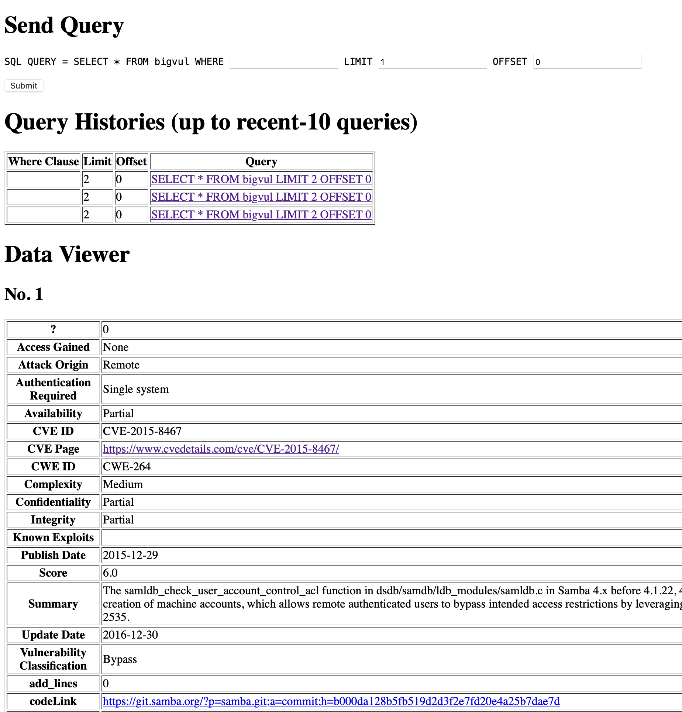

# Big-Vul Plain HTML Visualizer

Visualize [Big-Vul dataset](https://github.com/ZeoVan/MSR_20_Code_vulnerability_CSV_Dataset) in HTML

## Requirement

- python 3.8.5 & packages in `requirements.txt`
- big-vul benchmark in sqlite3 database form. You should convert and put it in `data/bigvul.db`, where the db file contains the table named `bigvul`.

## Warning
- It supposed to use in localhost-only, since it naively-implemented.
- I've test my implementation using cleaned version 
  - i.e., `MSR_data_cleaned.csv` from https://drive.google.com/file/d/1-0VhnHBp9IGh90s2wCNjeCMuy70HPl8X/view?usp=sharing
